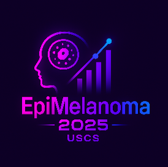

# 🏥 Dashboard de Análise # 🏥 Dashboard de Análise Epidemiológica - Câncer de Pele

<div align="center">

[](#)
[](#)
[](#)
[](#)

---



</div>

## 📑 Índice

- [📌 Visão Geral](#-visão-geral)
- [✨ Funcionalidades](#-funcionalidades)
- [💻 Tecnologias](#-tecnologias-utilizadas)
- [📊 Estrutura](#-estrutura-do-projeto)
- [🚀 Instalação](#-como-executar)
- [📚 Documentação](#-documentação-adicional)
- [🤝 Contribuição](#-contribuições)
- [📜 Licença](#-licença)

## 📊 Estrutura do Projetopidemiológica - Câncer de Pele

<div align="center">


</div>
## �📊 Estrutura do Projeto

```
AppIniciacaoCientifica/
├── 📱 cintificaCa.py          # Aplicação principal Streamlit
├── 🧩 componentes.py          # Componentes da interface
├── 📊 metricas.py            # Cálculos de indicadores epidemiológicos
├── 📑 tabs.py                # Configuração das abas da interface
├── 🛠️ utils.py               # Funções utilitárias
├── 📈 visualizations.py      # Funções de visualização de dados
├── 🎨 styles.py              # Estilos CSS personalizados
├── 📋 requirements.txt       # Dependências do projeto
├── 📖 README.md              # Documentação principal
├── 📚 manual_usuario.md      # Manual detalhado para usuários
├── 📚 manual_continuacao.md  # Guia para extensão do projeto
├── 📚 manual_criacao_zero.md # Tutorial para criar projeto similar
├── 🖼️ logo_inca.jpg         # Logo do INCA
├── 🖼️ logo_inca.png         # Logo do INCA em PNG
├── 🖼️ logo_sus.png          # Logo do SUS
├── 🖼️ logo_uscs.png         # Logo da USCS
└── 🖼️ logo.png              # Logo do projeto
```

## 📌 Visão Geral

<div align="center">


</div>

Dashboard interativo para análise epidemiológica de casos de câncer de pele no Brasil, utilizando dados do Ministério da Saúde. Esta aplicação permite visualizar e analisar dados sobre incidência, mortalidade, distribuição demográfica e outras métricas relevantes para pesquisadores e profissionais de saúde.

## ✨ Funcionalidades

| Categoria | Descrição |
|-----------|-----------|
| 📊 **Indicadores Epidemiológicos** | Taxas de incidência, prevalência e letalidade |
| 👥 **Análise Demográfica** | Distribuição por idade, sexo, raça/cor |
| 📈 **Análise de Mortalidade** | Por estado, sexo, raça/cor e idade |
| 📑 **Relatórios** | Geração de PDF com análises completas |
| 📊 **Visualizações Interativas** | Gráficos e dashboards responsivos |
| 🎨 **Interface Moderna** | Design intuitivo e visual agradável |

## 💻 Tecnologias Utilizadas

<div align="center">

| Tecnologia | Descrição |
|------------|-----------|
|  | Linguagem base |
|  | Framework para criação de aplicativos web |
|  | Manipulação e análise de dados |
|  | Visualizações interativas |
|  | Animações modernas |
|  | Componentes adicionais |
|  | Geração de relatórios em PDF |

</div>

## 🚀 Como Executar

1. **Clone o repositório**:
   ```bash
   git clone https://github.com/karinammorais/AppIniciacaoCientifica.git
   cd AppIniciacaoCientifica
   ```

2. **Crie um ambiente virtual**:
   ```bash
   python -m venv venv
   source venv/bin/activate  # No Windows: venv\Scripts\activate
   ```

3. **Instale as dependências**:
   ```bash
   pip install -r requirements.txt
   ```

4. **Execute a aplicação**:
   ```bash
   streamlit run app.py
   ```

5. **Acesse no navegador**:
   A aplicação estará disponível em `http://localhost:8501`

## 📁 Formato dos Dados

<details>
<summary>Requisitos do Arquivo de Dados</summary>

### 📊 Formato do Arquivo
- Formato: Excel (`.xlsx`)
- Nomenclatura: `inCA_YYYY.xlsx` (ex: `inCA_2021.xlsx`)

### 📋 Colunas Obrigatórias
| Campo | Descrição | Tipo |
|-------|-----------|------|
| `DTDIAGNO` | Data do diagnóstico | Data |
| `LOCTUPRI` | Localização do tumor | Texto |
| `SEXO` | Sexo do paciente | M/F |
| `IDADE` | Idade do paciente | Número |
| `RACACOR` | Raça/Cor | Texto |

</details>

## 📊 Exemplos de Visualizações

<div align="center">

| Tipo | Descrição | Formato |
|------|-----------|---------|
| 🗺️ **Mapas de Calor** | Distribuição de casos por estado | Interativo |
| 🥧 **Gráficos de Pizza** | Distribuição por sexo e raça/cor | Estático/Interativo |
| 📊 **Gráficos de Barras** | Análise por idade | Estático/Interativo |
| 📈 **Cards Métricos** | Indicadores principais | Atualização em tempo real |
| 📑 **Relatórios PDF** | Exportação de análises | Documento |

</div>

## 🔄 Atualizações Futuras

<div align="center">

| Status | Funcionalidade | Descrição |
|--------|---------------|-----------|
| ⏳ | **Machine Learning** | Implementação de previsões e análises preditivas |
| 🔄 | **Novas Fontes** | Integração com outras bases de dados de saúde |
| 📊 | **Comparações Temporais** | Análise de tendências entre diferentes anos |
| 🗺️ | **Visualizações Geo** | Mapas e análises geoespaciais avançadas |
| 💾 | **Exportação** | Suporte a múltiplos formatos de exportação |

</div>

## � Documentação Adicional

Para facilitar o uso e desenvolvimento do projeto, foram criados três manuais detalhados:

1. **[Manual do Usuário](manual_usuario.md)**: Guia completo sobre como utilizar todas as funcionalidades do dashboard, incluindo dicas de navegação, uso de filtros e geração de relatórios.

2. **[Manual de Continuação](manual_continuacao.md)**: Instruções detalhadas para adaptar este projeto para outros tipos de câncer ou bases de dados similares, incluindo requisitos de dados e passos para adaptação.

3. **[Manual de Criação do Zero](manual_criacao_zero.md)**: Tutorial passo a passo para criar um projeto similar desde o início, incluindo configuração do ambiente, estrutura do projeto e boas práticas.

## �📣 Contribuições

Contribuições são bem-vindas! Sinta-se à vontade para abrir issues ou enviar pull requests com melhorias e correções. Consulte os manuais para entender melhor a estrutura do projeto.

## 📜 Licença

Este projeto está licenciado sob a licença MIT - veja o arquivo LICENSE para mais detalhes.

---

Desenvolvido com ❤️ para análise de dados epidemiológicos 
